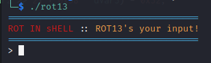
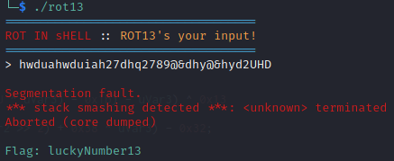

# National Cyber Scholarship Competition (NCS) - Spring 2021

* **Category:** Binary Easy 02 (BE02)
* **Points:** 100pts

## Challenge

> The only given is an ELF binary named `rot13`. Running the binary `chmod +x rot13`, `./rot13` gives you this:

> 
> The program just ROT13 encrypted whatever you put in.
## Solution
As I was testing the program, I seemed to get the intended solution by chance. 
The solution is gained by `segfault`'ing the program, which can be done by overwhelming the program.
This was the verified answer after seeing the source code.



```
FLAG: luckyNumber13
```