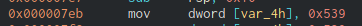

# National Cyber Scholarship Competition (NCS) - Spring 2021

* **Category:** Binary Medium 02 (BM02)
* **Points:** 250pts

## Challenge

> The only given is an ELF binary named `program`. Running the binary `chmod +x program`, `./program` gives you this:

>
> The program responds with this no matter what.
## Solution
Opening the program with Ghidra reveals that in order to run the flag print function, the argument needs to equal 1337.
Changing this variable from `0x1` to `0x539` allows the function to print normally.




```
FLAG: patchItFixIt
```