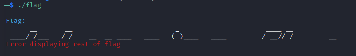
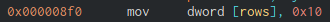
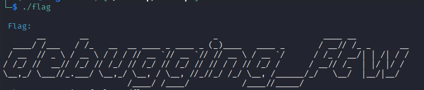

# National Cyber Scholarship Competition (NCS) - Spring 2021

* **Category:** Binary Medium 03 (BM03)
* **Points:** 250pts

## Challenge

> The only given is an ELF binary named `flag`. Running the binary `chmod +x flag`, `./flag` gives you this:

>
> The program responds with this no matter what.
## Solution
Opening the program with Ghidra reveals that in order to run the flag print program, you need to change a setting.
Quick and easy, changing the `dword` from 2 rows to anything over 6 (I did 16 just to be safe).




> Note: Case sensitive, ftw needs to have a lowercase f
```
FLAG: debugging_ftw
```