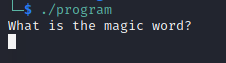

# National Cyber Scholarship Competition (NCS) - Spring 2021

* **Category:** Binary Hard 01 (BH02)
* **Points:** 500pts
* **Author:** [Mobmaker](https://github.com/Mobmaker55)

## Challenge

> The only given is an ELF binary named `program`. Running the binary `chmod +x program`, `./program` gives you this:\

>
> The program allows you to enter a string, and responds with an obfuscated string.
## Solution
**Intended Solution**:
The intended solution was to simply try up the stack in Unicode characters until finding `~` as the solution.
The letter A would unlock part of the string, B would unlock a little more, etc, working up to `~`.\
Using a string of `~~~~~~~~~~~~~~` gives you the intended solution:\


I did not use the intended solution, I merely got 90% of the answer and then brute forced it.
By spamming the prompt with text, I was able to get this much of the flag:


At this point, `aLittLeObfuScatIonalCha` was enough to guess that the last part would be some variation of `Character`.
Guessing gave me `aLittLeObfuScatIonalCharActEr`, and there was the flag!

```
FLAG: aLittLeObfuScatIonalCharActEr
```