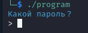

# National Cyber Scholarship Competition (NCS) - Spring 2021

* **Category:** Binary Medium 01 (BM01)
* **Points:** 250pts
* **Author:** [Mobmaker](https://github.com/Mobmaker55)

## Challenge

> The only given is an ELF binary named `program`. Running the binary `chmod +x program`, `./program` gives you this:\

>
> The program is asking you for the password (in Russian), and responds in Russian too.
## Solution
The easiest way to solve this is to simply "short-circuit" the logic, or bypass the password check.
To do this, just open the binary and replace `test eax, eax` with `mov rax, 0`


```
FLAG: luckyNumber13
```