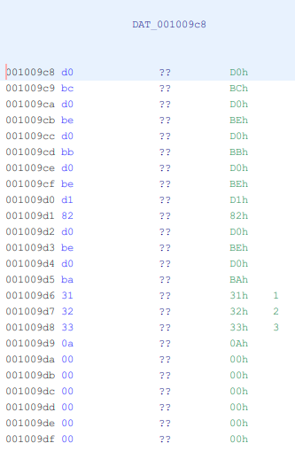
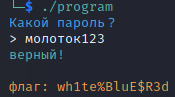

# National Cyber Scholarship Competition (NCS) - Spring 2021

* **Category:** Binary Medium 01 (BM01)
* **Points:** 250pts
* **Author:** [Mobmaker](https://github.com/Mobmaker55)

## Challenge

> The only given is an ELF binary named `program`. Running the binary `chmod +x program`, `./program` gives you this:\

>
> The program is asking you for the password (in Russian), and responds in Russian too.
## Solution
The solution I used was to find the password, and use that to get the flag. 
There are other ways, but this is the way that seemed easiest to me.\
Opening `program` in Ghidra reveals a `strcmp` showing an address to the password, comparing it to your input.
Following the address, you get the hex form of the password.\
\
After this, just put the hex bytes into a Hex to UTF-8 converter, and you get the password in Russian.
> Hex value: `d0 bc d0 be d0 bb d0 be d1 82 d0 be d0 ba 31 32 33`\
> Password: `молоток123`

Just use the password with `program`, and you're done!\

```
FLAG: wh1te%BluE$R3d
```