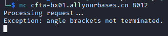
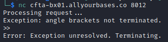
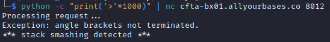
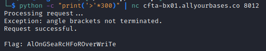

# National Cyber Scholarship Competition (NCS) - Spring 2021

* **Category:** Binary Extreme 01 (BX01)
* **Points:** 1000pts
* **Author:** [Mobmaker](https://github.com/Mobmaker55)

## Challenge

> You are to access a network endpoint `cfta-bx01.allyourbases.co` with port `8012`\
> "Format a valid request" is all further information provided.
## Solution
Contacting the service through `netcat` gives us our first clue.\
`nc cfta-bx01.allyourbases.co 8012`

\
The "angle brackets not terminated" hints at needing angle brackets as part of the solution.\
So, angle brackets!\
\
Next idea, hit it with a bunch of brackets using Python.\
`python -c "print('>'*1000)" | nc cfta-bx01.allyourbases.co 8012`\


Too many brackets, huh? After some trial and error, 300 did the trick.\
`python -c "print('>'*300)" | nc cfta-bx01.allyourbases.co 8012`\
\
And there's the flag! 

```
FLAG: AlOnGSeaRcHFoROverWriTe
```