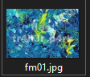

# National Cyber Scholarship Competition (NCS) - Spring 2021

* **Category:** Forensic Medium 01 (FM01)
* **Points:** 250pts
* **Author:** [randompwner](https://github.com/randompwner)

## Challenge

> Download the file and find a way to get the flag.

## Solution
I noticed in the windows file explorer the thumbnail of the file showed the flag.

Upon opening the jpeg we are greeted with the colors of the rainbow splashed everywhere not the image from the thumbnail.

I tried zooming into the thumbnail and guessed the flag from what I could make out.
However this was definitely not the intended sol so knowing that image thumbnails are sometimes stored as metadata that was my next move.

Simply using `exiftool` to view the metadata
> `exiftool fm01.jpg`

And in the ouput we see
```
History When                    : 2021:03:12 13:28:07Z, 2021:03:12 13:28:07Z
History Software Agent          : Adobe Photoshop 22.2 (Windows), Adobe Photoshop 22.2 (Windows)
History Changed                 : /, /
Text Layer Name                 : flag: tr4il3r_p4rk
Text Layer Text                 : flag: tr4il3r_p4rk
Document Ancestors              : E25BCF5D355B2F2CE5EB55EC6B67C7AF
Image Width                     : 1920
Image Height                    : 1295

```
```
FLAG: tr4il3r_p4rk
```