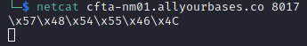
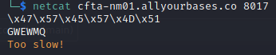
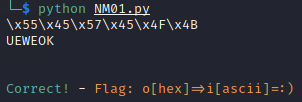

# National Cyber Scholarship Competition (NCS) - Spring 2021

* **Category:** Networking Medium 01 (NM01)
* **Points:** 250pts
* **Author:** [Mobmaker](https://github.com/Mobmaker55)

## Challenge

> You are given the address `cfta-nm01.allyourbases.co`, and you are to retrieve data from port `8017`.

## Solution
Step one: communicate with the remote address.
> `netcat cfta-nm01.allyourbases.co 8017`

\
Seeing this information, we know that we have to do something with those characters. 
Those characters are, in fact, escaped unicode characters.\
For example, putting`\x47\x57\x45\x57\x4D\x51` into "escaped unicode to text" gives us `GWEWMQ`.
Putting this back into the `netcat` instance, however, returns an interesting result:
\
From this, it is determined we would need a script.
Python's `socket` utility is quite resourceful for connecting with the server quickly.

Step Two: begin scripting a solution.
```
import socket

sock = socket.socket(socket.AF_INET, socket.SOCK_STREAM)

host = "cfta-nm01.allyourbases.co"
port = 8017

sock.connect((host, port))
print(str(sock.recv(4096)))
```
And we have a connection! The script prints back exactly what we'd want, those escaped unicode characters.
Now, to make these escaped unicode characters not-escaped, you need to use `str.decode()` on the text.\
Python 3 was being difficult, so Python 2 was used instead (this only worked in my favor half of the time).
Using Python 2, the bottom two lines became:
```
sock.connect((host, port))
raw = str(sock.recv(4096))
print(raw)
# This causes issues in Python 3
thaw = raw.decode('unicode-escape') 
print(thaw)
sock.send(thaw)
print(str(sock.recv(4096)))
```
At this point, you would think that you are almost done. However, there were a few issues that were left to work out.
Due to how Python 2's implementation of `socket.send` worked, there was no "newline" or `'\n'` on send.\
As I didn't know this, I spent an hour debugging for no gain. After adding a line to fix that, there was one more issue.
The only response I was getting from the server was `'\n'`.\
I thought the game was mocking me, but it turns out there was a different cause.
Server-side communication sends more than one line, with the second line being about half a second later.
To capture both of these, the last two lines became:
```
#Make sure to put this at the top
import time

sock.send(thaw)
sock.send('\n')
print(str(sock.recv(4096)))
time.sleep(0.5)
print(str(sock.recv(4096)))
```
With this new solution, the Flag was obtained successfully! The full script can be found [here](./assets/NM01.py)!


```
FLAG: o[hex]=>i[ascii]=:)
```