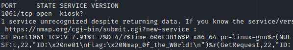

# National Cyber Scholarship Competition (NCS) - Spring 2021

* **Category:** Networking Easy 01 (NE01)
* **Points:** 100pts
* **Author:** [Mobmaker](https://github.com/Mobmaker55)

## Challenge

> You are given the address `cfta-ne01.allyourbases.co`, and are told to find a TCP networking service.
> The service will be identified with `ID: ne01`.

## Solution
At least for me, using `nmap` was basically all I had to do to get the flag.
> `sudo nmap -v -sV cfta-ne01.allyourbases.co`

Running this `nmap` command reveals port `1061` being open, and also shows two bits of data:
> `ID:\x20ne01` (ID: ne01)\
> `Flag:\x20Nmap_0f_the_W0rld!` (Flag: Nmap_0f_the_W0rld!)  


After having received these two bits of information, you are done with the challenge.

```
FLAG: Nmap_0f_the_W0rld!
```
