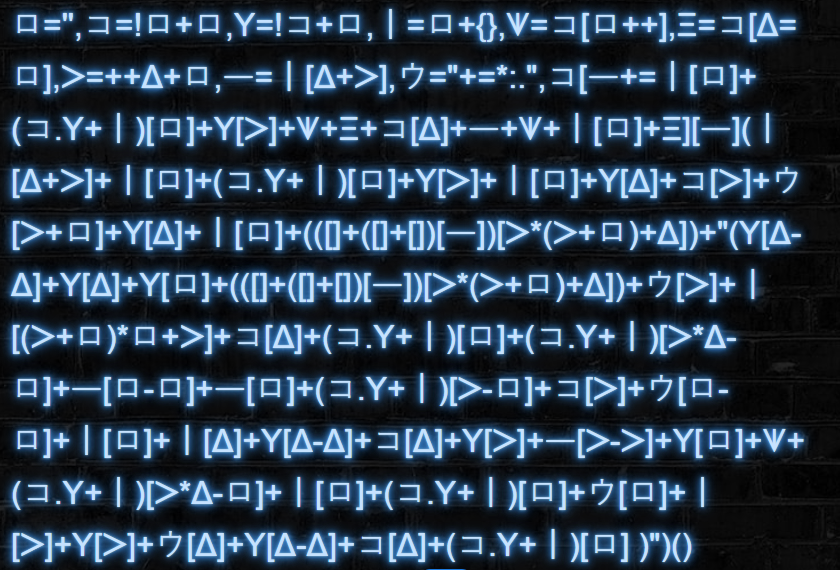
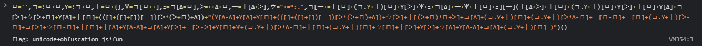

# National Cyber Scholarship Competition (NCS) - Spring 2021

* **Category:** Web Easy 01 (WE01)
* **Points:** 100pts
* **Author:** [Mobmaker](https://github.com/Mobmaker55)

## Challenge

> Go to website https://cfta-we01.allyourbases.co/ and get the flag.
## Solution
Upon opening the website, there is an interesting string of characters:\


It looks kind of like JavaScript (it looks similar to some other parts in this comp)... 
Plugging it into a JavaScript console reveals the flag!\


```
FLAG: unicode+obfuscation=js*fun
```