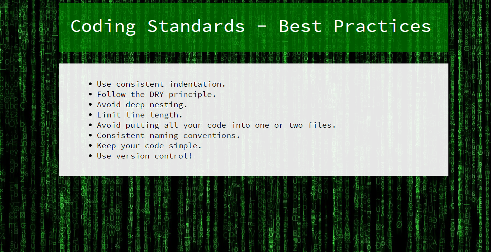
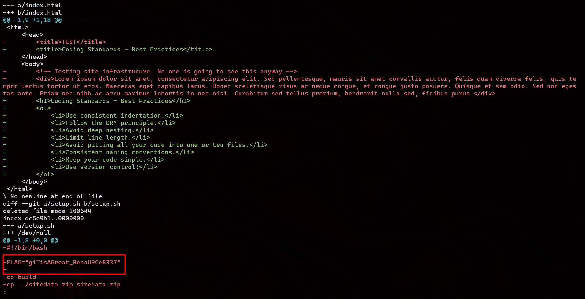

# National Cyber Scholarship Competition (NCS) - Spring 2021

* **Category:** Web Hard 02 (WM02)
* **Points:** 500pts
* **Author:** [Anub1s/Unnatural Firewall](https://github.com/Akshay-Rohatgi)

## Challenge

> Access the site at https://cfta-wh02.allyourbases.co and find a way to get the flag.

Visiting the site we're greeted with this page:  


The first time I looked at this challenge I thought it was basically impossible or something and closed it. I came back to it an hour later and then actually decided to look at the text on the site. 
```
Use consistent indentation.
Follow the DRY principle.
Avoid deep nesting.
Limit line length.
Avoid putting all your code into one or two files.
Consistent naming conventions.
Keep your code simple.
Use version control!
```

**Use Version control**

I saw that and had a revelation. 

https://cfta-wh02.allyourbases.co/.git/

IT WAS A GIT REPO??????!!!!!!

However running `git clone https://cfta-wh02.allyourbases.co/.git/` wasn't working, I did a little bit of googling on how to grab repos from websites and found [this](https://blog.jakubjuszczak.de/writeup-ctf-0x00sec-web-exercise-1/) writeup. 

Using this command: `wget -r --no-parent --connect-timeout=5 https://cfta-wh02.allyourbases.co/.git/`, I was able to cleanly clone the repo. 

Ran the following commands:
```bash
cd cfta-wh02.allyourbases.co
git log -p
```

LOL  


```
FLAG: giTisAGreat_ResoURCe8337
```
