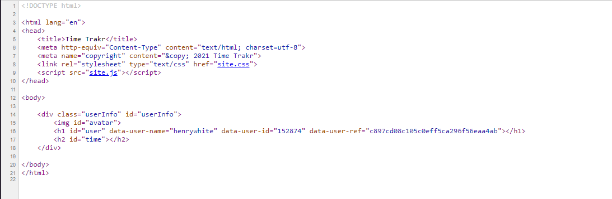
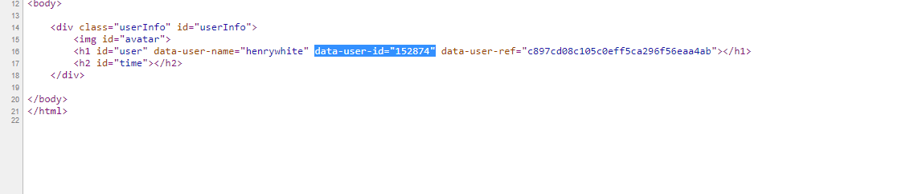
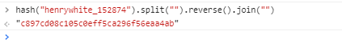

# National Cyber Scholarship Competition (NCS) - Spring 2021

* **Category:** Web Medium 02 (WE02)
* **Points:** 250pts
* **Author:** [Anub1s/Unnatural Firewall](https://github.com/Akshay-Rohatgi)

## Challenge

> View the page at https://cfta-wm02.allyourbases.co and try to get the flag.

## Solution
Upon opening the site we see this:  


It looks like the website identifies us as the user `henrywhite` and gives us some sort of user creation time?

Let's check the site source-  


Looking at the source, we see that there's a sourced script called `site.js`. Let's check it out. 

A specific function here is interesting:
```js
function checkUser() {
    if (get("user").dataset['userRef'] === hash(get("user").dataset['userName'] + "_" + get("user").dataset['userId']).split("").reverse().join("")) {
        if (-1 === get("avatar").src.indexOf(get("user").dataset['userRef'] + ".jpg")) {
            top.initTime = undefined;
            fetch('api/' + get("user").dataset['userRef'] + '.json')
                .then(response => {
                    if (false === response.ok) {
                        get("user").innerText = "Invalid user";
                        get("time").innerHTML = "";
                    }
                    return response.json();
                })
                .then(json => {
                    top.initTime = json.time;
                    get("avatar").src = get("user").dataset['userRef'] + ".jpg";
                    get("user").innerText = "Hello " + get("user").dataset['userName'] + "!";
                    if ("undefined" !== typeof json.flag) {
                        get("userInfo").style.height = "400px";
                        get("userInfo").style.margin = "-200px 0 0 -150px";
                        get("userInfo").style.color = "#b00";
                        setTimeout(function () {
                            get("userInfo").innerHTML += "<br><br>" +
                                "Flag:<br>" + json.flag;
                        }, 2200);
                    }
                })
        }
        if ("undefined" !== typeof top.initTime) {
            get("time").innerHTML = "Secs since init:<br>" + parseInt(Date.now() / 1000 - top.initTime, 10);
        }
    } else {
        get("user").innerText = "User data error";
        get("time").innerHTML = "";
    }
}
```

The most interesting part is this like here:
```js
if (get("user").dataset['userRef'] === hash(get("user").dataset['userName'] + "_" + get("user").dataset['userId']).split("").reverse().join(""))
``` 

Looks like it checks a userRef JSON against the hashed value of the user + user ID reversed.

So in theory if there was a username called `rowrowurboat` and the user had an ID of `4321` then the new string would be: `rowrowurboat_4321`. And then the json path would be found by getting the hash of the string and reversing the hash. 

*side note: JSON path is structured like `api/<hash>.json`*

We can attempt this with `henrywhite` and see what we find.

We can get the userid by checking the source of the original page:  


*side note: it looks like the user ref is also available here so we can check against it later*

So the string to hash is: `henrywhite_152874`

Then we can hash and reverse the string using their own function-  


hash: `c897cd08c105c0eff5ca296f56eaa4ab`

Now lets try accessing the JSON user Ref for `henrywhite`  

It works!  
https://cfta-wm02.allyourbases.co/api/c897cd08c105c0eff5ca296f56eaa4ab.json

```json
{
  "time": 1613262914
}
```

now using super-guessing powers we can assume that the admin JSON is what we're trying to gain access to, we can also assume that the admin would have a user id of 0. Lets try it!

Our new string: `admin_0`

We run this in the console to get our hash:
```js
hash("admin_0").split("").reverse().join("")
```

And we get back `31f7934415f3d31c64359bd51d378177` as our hash.

If we navigate to https://cfta-wm02.allyourbases.co/api/31f7934415f3d31c64359bd51d378177.json we get our flag!

```json
{
  "time": 0,
  "flag": "epoch_wizard"
}
```

```
FLAG: epoch_wizard
```